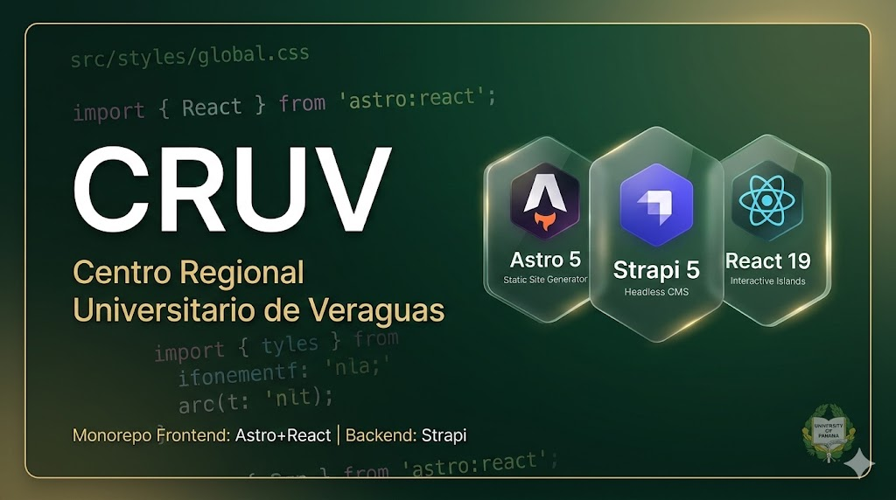

# CRUV — Centro Regional Universitario de Veraguas

<p align="center">
  
</p>

Sitio web institucional del **Centro Regional Universitario de Veraguas (CRUV)**, sede regional de la Universidad de Panamá en Santiago, Veraguas.

Monorepo con frontend estático generado con **Astro** y CMS headless con **Strapi**.

## Stack Tecnológico

| Capa | Tecnología |
|------|-----------|
| Frontend | [Astro](https://astro.build/) 5 (SSG) + [React](https://react.dev/) 19 (islas interactivas) |
| Estilos | [Tailwind CSS](https://tailwindcss.com/) 4 (plugin Vite, tema custom vía `@theme`) |
| CMS | [Strapi](https://strapi.io/) 5 (headless, REST API) |
| Base de datos | SQLite (desarrollo) · MySQL/PostgreSQL (producción) |
| Lenguaje | TypeScript |
| Package manager | npm |

## Estructura del Proyecto

```
up-cruv/
├── frontend/           # Astro — sitio estático
│   ├── src/
│   │   ├── pages/          # Rutas (file-based routing)
│   │   ├── layouts/        # Layout wrappers
│   │   ├── components/     # Componentes por dominio
│   │   ├── lib/            # Datos, utilidades, helpers
│   │   └── styles/         # CSS global y tema Tailwind
│   └── public/             # Assets estáticos
├── backend/            # Strapi — CMS headless
│   ├── config/             # Configuración del servidor y plugins
│   ├── src/api/            # Content types personalizados
│   └── types/generated/    # Tipos auto-generados (no editar)
└── CLAUDE.md           # Convenciones para agentes LLM
```

## Requisitos Previos

- **Node.js** >= 20.0.0 (hasta 24.x)
- **npm** (incluido con Node.js)

## Instalación

```bash
# Clonar el repositorio
git clone <url-del-repo> up-cruv
cd up-cruv

# Instalar dependencias del frontend
cd frontend && npm install

# Instalar dependencias del backend
cd ../backend && npm install
```

> **Nota:** Ejecutar `npm install` dentro de cada directorio (`frontend/` o `backend/`), nunca en la raíz.

## Desarrollo

Abrir dos terminales:

```bash
# Terminal 1 — Backend (puerto 1337)
cd backend
npm run dev
```

```bash
# Terminal 2 — Frontend (puerto 4321)
cd frontend
npm run dev
```

- **Frontend:** http://localhost:4321
- **Admin Strapi:** http://localhost:1337/admin

## Build de Producción

```bash
# Frontend — genera sitio estático en frontend/dist/
cd frontend && npm run build

# Backend — compila el admin panel
cd backend && npm run build

# Iniciar backend en producción
cd backend && npm run start
```

## Configuración

### Variables de Entorno

Copiar `.env.example` a `.env` en cada proyecto y completar los valores:

```bash
cp backend/.env.example backend/.env
```

> Los archivos `.env` **nunca** se commitean al repositorio.

### Tema y Diseño

El sistema de diseño está definido en `frontend/src/styles/global.css` usando la directiva `@theme` de Tailwind v4:

- **Colores primarios:** verde bosque profundo + oro institucional
- **Tipografía:** Playfair Display (headings) + Montserrat (body)
- **Componentes CSS:** `.glass`, `.glass-card`, `.btn-gold`, `.btn-gold-glow`, `.btn-ghost`

## Convenciones

- **Astro** (`.astro`) para contenido estático; **React** (`.tsx`) solo para interactividad del lado del cliente.
- Código en **inglés**; contenido visible al usuario en **español**.
- TypeScript strict en frontend.
- Path aliases: `@components/`, `@layouts/`, `@lib/`, `@styles/`.

Para más detalle sobre convenciones, arquitectura y guías de desarrollo, consultar [`CLAUDE.md`](./CLAUDE.md).

## Licencia

Proyecto institucional de la Universidad de Panamá — Centro Regional Universitario de Veraguas.
